# A06367

## Общее
Ссылка на Jira: https://jira.vk.team/browse/???

Ссылка на проект: https://a06367.ru

Окружение:
* Windows 10, 16 gb ОЗУ, экран 14-дюймовый (3840 × 2400)
  Google Chrome Версия 99.0.4844.74 (Официальная сборка), (64 бит)

## Тестирование
Основные пункты UI/UX:

* Общие элементы
* Авторизация и регистрация
  * Форма регистрации
    * Валидация полей форм с подсказками - имя пользователя (минимальная длина имени пользователя), пароль (минимальная длина пароля)
    * Баг: отсутствует проверка максимальной длины имени пользователя, при слишком длинном имени ломается вёрстка хедера, 
    невозможно увидеть иконки логаута и личного кабинета
    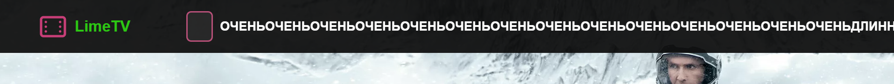
    * Баг: отсуствует ограничение поля длины пароля - в сообщении об ошибке указано, что пароль может быть от 6 до 16 символов, однако
    прользователь
    * Баг: иконка "показать/скрыть пароль" не адаптирована под все экраны, элемент касается границы поля ввода (Ipad) или выходит за 
    границы поля ввода (Surface)
    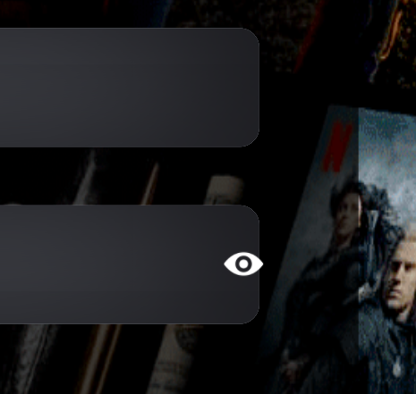
  * Форма авторизации
    * Валидация полей форм с подсказками - имя пользователя, пароль
    * Баг: при вводе неподходящего логина или пароля при слишком коротком пароле отображается подсказка, что пароль должен быть от 6
    до 16, при пароле от 6 символов отображается правильная подсказка
    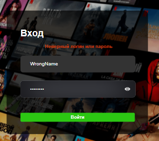
    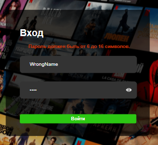

* Страница фильма
    * Общий вид
        - страница разделена на блоки: информация о фильме и кнопки взаимодействия с ним
    * Блок основной информации о фильме
        - Основная информация о годе выпуска, жанре, длительносте фильма и его озвучке
        - Режиссер
        - Главные актеры с ссылкой на их страницу

          
      * Лейбл возрастного ограничения на фильм 
    
          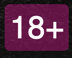
    * Главный постер фильма на фоне информации о нем
    * Кнопка смотреть позже
      - только для авторизованных пользователей (вылезает окно с подсказкой авторизоваться) 
      
          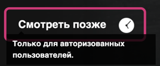
    * Кнопка лайка
        - только для авторизованных пользователей (вылезает окно с подсказкой авторизоваться)
          
          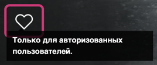
    * Кнопка смотреть фильм
        - некоторые фильмы нельзя посмотреть без подписки (вылезает окно с подсказкой на оформление подписки)
      
          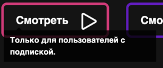
        - только для авторизованных пользователей (вылезает окно с подсказкой авторизоваться)
    * Блок описания фильма
        - представлен в виде текста с описанием
    * Рейтинг фильма
      - только для авторизованных пользователей

          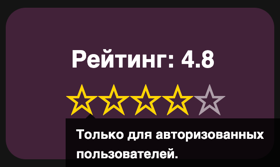
      - динамическое обновление рейтинга
      - представлен в виде нажимающихся звездочек, которые закрашиваются слева-направо до той, на которую нажимает пользователь

          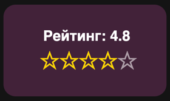
    * Список серий и сезонов (только для страницы сериала)
        - представлен в виде карусели иконок серий на каждый сезон
        - при наведении на каждый элемент иконка увеличивается
        - если сериал по подписке, то к иконке прикреплен лейбл с деньгой
        - при наведении на элемент появляется подсказка о необходимости подписки для просмотра серии
        - каждая серия пронумерована соответствующим лейблом

          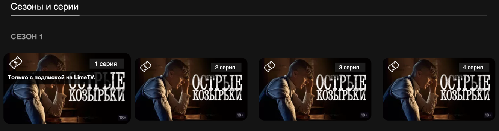
        - при нажатии переход на страницу фильма
    * Остальная информация о фильме
        - информация о стране производства, дате премьеры в мире и России, бюджет
        - жанры, с ссылкой на страницу данного жанра
        - информация о съемочной группе, список актеров с ссылкой на страницу каждого актера
        - информация о звуке и субтитрах
* Страница актера
   * Общий вид
      - страница разделена на блоки: информация об актере и кнопки на страницы жанров и фильмов
   * Фотография актера
   * Информация об актере
      - основная информация о росте и дате рождения
      - жанры в которых актер снимается, с ссылкой на страницу жанра (сслыка подсвечивается при наведении курсора)

        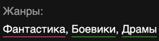
   * Список фильмов и сериалов, в которых актер снимался
      - представлен в виде карусели иконок фильмов, при нажатии можно перейти на страницу фильма

        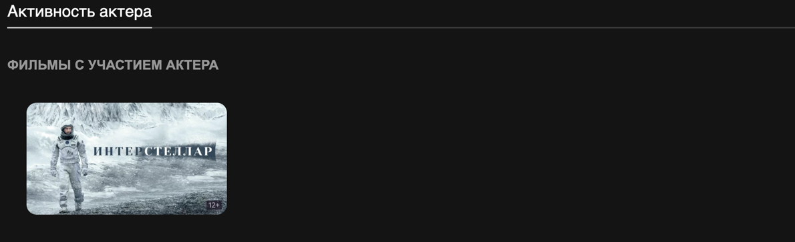
* Страница личного кабинете пользователя
    * Общий вид
        - информация о пользователе, никнейм, текущая подписка
        - аватар
        - личная подборка фильмов
        - форма оплаты
    * Иконка настроек пользователя
        - при наведении меняет форму и цвет рамки
        
            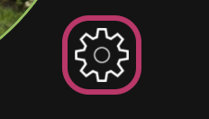
    * Инфомация о пользователе
        - если отсутсвует описание пользователя о себе, то на это месте стоит прочерк
        - если у пользователя нет подписки, то на месте поля подписки выводится сообщенрие что активных подписок нет
  
           
        - баг - если имя занимает много букв то оно занимает поле `О себе`
      
           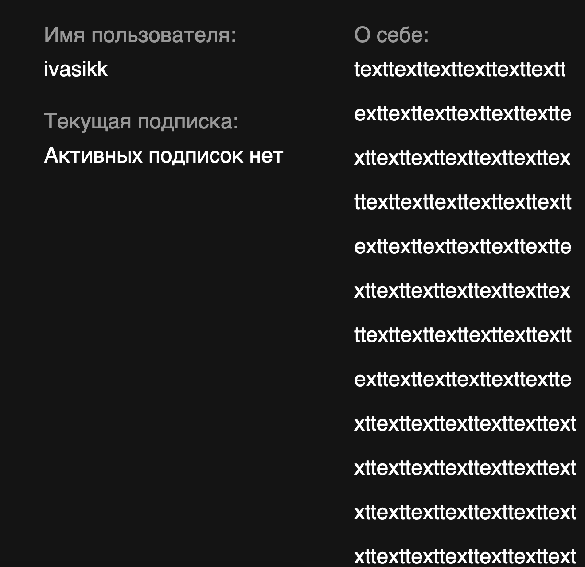
        - баг - если добавить супер длинное описание о себе, то страница растянется и не будет влезать в экран браузера
      
           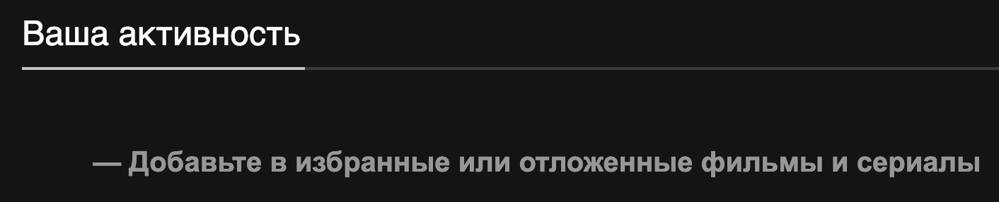
    * Элемент подборок пользователя 
        - если пользователь добавляет фильмы в избранное или смотреть позже то фильмы выстраиваются в две соответствующие карусели
        - при отстутствии подборок на месте карусели стоит надпись приглашающая добавить фильмы
  
            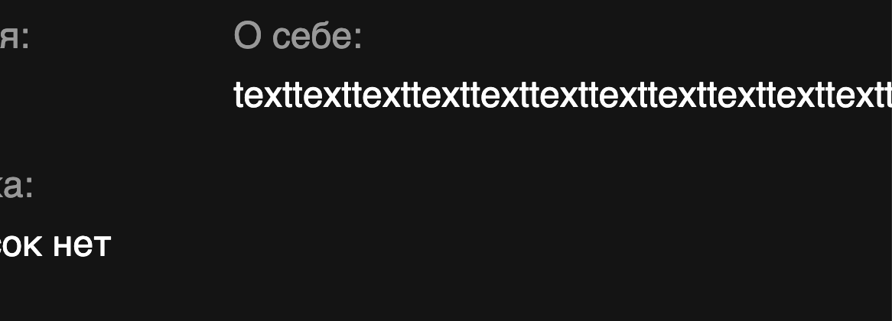
    * Форма оплаты
        - состоит из двух чекбоксов для выбора способа оплаты
        - кнопка перейти к оплате перенапрявляет пользователя на старницу ЮMoney
        - баг - при оплате на ЮMoney пользовтель возвращается на главную страницу сайта
  
            