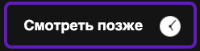
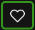
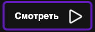
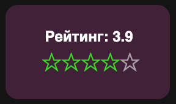
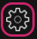
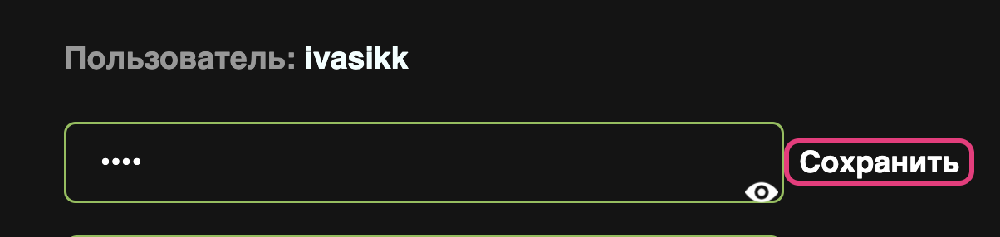
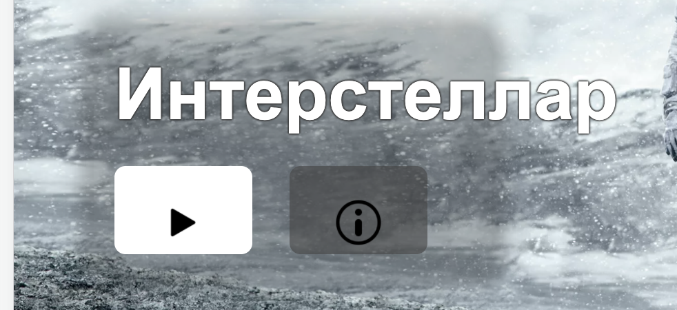
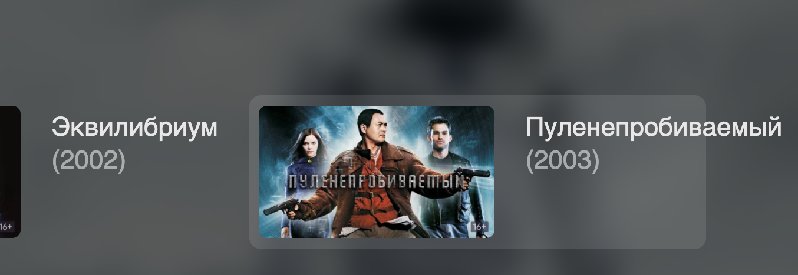

# A06367

## Общее
Ссылка на Jira: https://jira.vk.team/browse/VKEDU-106

Ссылка на проект: https://a06367.ru

Окружение:
* Windows 10, 16 gb ОЗУ, экран 14-дюймовый (3840 × 2400)
  Google Chrome Версия 99.0.4844.74 (Официальная сборка), (64 бит)

## Тестирование
Основные пункты UI/UX:

## Общие элементы
###1. Авторизация и регистрация
* Форма регистрации
    * Валидация полей форм с подсказками - имя пользователя (минимальная длина имени пользователя), пароль (минимальная длина пароля)
    * Баг: отсутствует проверка максимальной длины имени пользователя, при имени длинною символов >50 ломается вёрстка хедера,
      невозможно увидеть иконки логаута и личного кабинета
    
      
    * Баг: отсутствует ограничение поля длины пароля - в сообщении об ошибке указано, что пароль может быть от 6 до 16 символов, однако
      пользователь может ввести любое количество символов
    * Баг: иконка "показать/скрыть пароль" не адаптирована под все экраны, элемент касается границы поля ввода (Ipad) или выходит за
      границы поля ввода (Surface)
       
      

* Форма авторизации
    * Валидация полей форм с подсказками - имя пользователя, пароль
    * Баг: при вводе неподходящего логина или пароля при слишком коротком пароле отображается подсказка, что пароль должен быть от 6
      до 16, при пароле от 6 символов отображается правильная подсказка

       

###2. Страница фильма https://a06367.ru/film/interstellar
* Общий вид
    - страница разделена на блоки: информация о фильме и кнопки взаимодействия с ним
* Блок основной информации о фильме
    - основная информация о годе выпуска, жанре, режиссере, длительности фильма и его озвучке
    - главные актеры с ссылкой на их страницу
      - при наведении на ссылку меняется цвет пдочеркивания с зеленого на розовый
    * Лейбл возрастного ограничения на фильм
* Главный постер фильма на фоне информации о нем
* Кнопка смотреть позже
    - только для авторизованных пользователей (вылезает окно с подсказкой авторизоваться)
    - при наведении меняет цвет с фиолетового на розовый
    - при нажатии закрашиваетя в зеленый

        

* Кнопка лайка
    - только для авторизованных пользователей (вылезает окно с подсказкой авторизоваться)
    - при наведении меняет цвет с зеленого на розовый
    - при нажатии закрашиваетя в зеленый
    - при нажатии фильм добавляется в подборку любимых фильмов пользователя

      

* Кнопка смотреть фильм
    - некоторые фильмы нельзя посмотреть без подписки (вылезает окно с подсказкой на оформление подписки)
    - только для авторизованных пользователей (вылезает окно с подсказкой авторизоваться)
    - при наведении меняет цвет с фиолетового на розовый
    - при нажатии переход на страницу плеера
        
      

* Блок описания фильма
    - представлен в виде текста с описанием
* Рейтинг фильма
    - только для авторизованных пользователей
    - представлен в виде нажимающихся звездочек
    - при нажатии на звездочку все остальные, слева от кликнутой, меняют цвет на зеленый
    - при нажатии на звездочку динамически обновляется рейтинг фильма

      

* Список серий и сезонов (только для страницы сериала)
    - представлен в виде карусели иконок серий на каждый сезон
    - при наведении на каждый элемент иконка увеличивается на 10%
    - если сериал по подписке, то к иконке прикреплен лейбл с купюрой
    - при наведении на элемент появляется подсказка о необходимости подписки для просмотра серии
    - каждая серия пронумерована соответствующим лейблом
    - при нажатии переход на страницу фильма
* Остальная информация о фильме
    - информация о стране производства, дате премьеры в мире и России, бюджет
    - жанры, с ссылкой на страницу данного жанра
      - при наведении на ссылку меняется цвет пдочеркивания с зеленого на розовый 
    - информация о съемочной группе, список актеров с ссылкой на страницу каждого актера
      - при наведении на ссылку меняется цвет пдочеркивания с зеленого на розовый
    - информация о звуке и субтитрах

###3. Страница актера https://a06367.ru/actor/215002be-64c1-11ec-90d6-0242ac120003
* Общий вид
    - страница разделена на блоки: информация об актере и кнопки на страницы жанров и фильмов
* Фотография актера
* Информация об актере
    - основная информация о росте и дате рождения
    - жанры в которых актер снимается, с ссылкой на страницу жанра
    - при наведении на ссылку меняется цвет пдочеркивания с зеленого на розовый

* Список фильмов и сериалов, в которых актер снимался
    - представлен в виде карусели иконок фильмов
    - при нажатии можно перейти на страницу фильма
    - при наведении на каждый элемент иконка увеличивается на 10%

###4. Страница личного кабинета пользователя https://a06367.ru/profile
(логин == пароль == `tester`)
* Общий вид
    - информация о пользователе, никнейм, текущая подписка
    - аватар
    - личная подборка фильмов
    - форма оплаты
* Иконка настроек пользователя
    - при наведении меняет форму рамки с квадратного на круглый
    - при наведении меняет цвет рамки с розового на зеленый
    - при нажатии переход на страницу настроек пользователя

      
      
* Информация о пользователе
  - если отсутствует описание пользователя о себе, то на это месте стоит прочерк
  - если у пользователя нет подписки, то на месте поля подписки выводится сообщение что активных подписок нет

  - баг - если имя занимает много букв то оно занимает поле `О себе`

    
  - баг - если поле `О себе` содержит длинное слово без пробелов, то текст уезжает за пределы страницы

    

  - баг - если добавить описание о себе с количеством символов > 200, то страница растянется и не будет влезать в экран браузера
 
    

* Элемент подборок пользователя
    - если пользователь добавляет фильмы в избранное или смотреть позже то фильмы выстраиваются в две соответствующие карусели
    - при отстутствии подборок на месте карусели стоит надпись приглашающая добавить фильмы

* Форма оплаты
    - состоит из двух чекбоксов для выбора способа оплаты
    - кнопка перейти к оплате перенаправляет пользователя на страницу ЮMoney
    - баг - при оплате на ЮMoney пользователь возвращается на главную страницу сайта

###5. Страница настроек пользователя https://a06367.ru/settings
(логин == пароль == `tester`)
* Общий вид
    - Аватар
    - Имя пользователя
    - Форма смены пароля
    - Форма информации о себе
* Смена аватара
    - при наведении на аватарку должна появиться размытая надпись `изменить`
    - при нажатии на `изменить` выпадает менеджер файлов где будет предложено выбрать фото и после загрузки фото будет сверху надпись `Успешно`
    - если фотография будет размером больше 200x200 то будет выведена надпись `Большой размер фотографии` и аватарка не будет обновлена
    - в случае успеха аватарка мгновенно обновляется на странице
    - под аватаром должна быть выведен имя пользователя
* Форма смены пароля
    - при введении пароля идет проверка, если пароль будет от 6 до 16 символов то будет выведена надпись `Пароль обновлен`
    - если пароль не будет от 6 до 16 символов то будет выведена надпись `Пароль должен быть от 6 до 16 символов.`
    - при нажатии кнопки показа пароля должен показан пароль введённый пользователем
    - баг - при разрешении экрана меньше 700px, но больше 648px то отсутствуют отступы у кнопки `сохранить` вместе с кнопкой показа пароля
    
      
* Форма смены информации о себе
    - при отсутствующей информации о себе, должна быть надпись `О себе` в текстовом поле
    - при нажатии кнопки сохранить должна быть выведена надпись `Сохранено`
    - форма не должна давать  пользователю ввести текст больше 512 символов
    - баг - при отсутствие валидации при пустом поле, не выводится информация над аватаркой что текст не сохранился

###6. Главная страница подборок https://a06367.ru
* Общий вид
    - Превью фильма
    - Элемент подборки жанров
    - Элемент подборки рекомендуем к просмотру
    - Элемент подборки популярное на Lime TV
    - Элемент подборки новое на Lime TV
* Превью фильма
    - при нажатии на кнопку плей, переходим в плеер с фильмом
    - при нажатии на кнопку информация, переходим на страницу фильма
    - баг - при разрешении экрана шириной 721px съезжают кнопки и затемнение не соответствует размеру текста названия фильма
    
      

* Элемент подборки жанров
    - содержит подборку жанров
    - при нажатии на жанр, переходим на страницу жанра
* Элемент подборки рекомендуем к просмотру
    - содержит подборку рекомендации к просмотру, подборка состоит из отложенных фильмов или сериалов пользователем
    - при нажатии на фильм переходим на страницу фильма
    - элемент должен отсутствовать если отложенных к просмотру нет
* Элемент подборки жанров
    - содержит подборку популярное на Lime TV
    - при нажатии на фильм переходим на страницу фильма
    - сортируется по рейтингу фильма указанного на странице фильма в разделе рейтинг
* Элемент подборки жанров
    - содержит подборку новое на Lime TV
    - при нажатии на фильм переходим на страницу фильма
    - сортируется по новизне фильма по премьере в мире указанного на странице фильма в разделе информация

###7. Поиск в navbar
* Общий вид
    - Элемент input в navbar
    - Элемент результатов поиска по фильмам
    - Элемент результатов поиска по актерам
* Элемент input в navbar
    - при нажатии на input открывается поиск
    - поле ввода названия фильма или актера
    - нельзя ввести в элемент input больше 30 символов
    - при пустом input результатом поиска является надпись `ВВЕДИТЕ ТЕКСТ`
    - при нажатии на крестик закрывается поиск
* Элемент результатов поиска по фильмам
    - при нажатии на фильм переход на страницу фильма
    - при наведении курсора появляется светлая область вокруг элемента фильма
    - баг - при длинном названии фильма тескт вылезает за границы светлого блока при наведении
    
      
* Элемент результатов поиска по актерам
    - используется полнотекстовый поиск, при вводе 1 символа, выводом будет все актеры в названии которых присутствует данный символ
    - при наведении курсора появляется светлая область вокруг элемента актера
    - при нажатии на актера переходим на страницу актера

###8. Страница плеера
* Общий вид
    - кнопка в виде крестика для выхода
    - панель управления видео с перемоткой, настройкой звука, кнопками страт/стоп, временем воспроизведения
* Кнопка выход
    - представлена в виде крестика
    - баг - при нажатии на крестик выход на главную страницу сайта
    - баг - кнопка никогда не пропадает
* Панель управления видео
    - баг - панель появляется только при наведении курсора в низ страницы
    - при нажатии на экран видео воспроизводится если до этого оно было остановлено
    - при нажатии на экран видео останавливает произведение если до этого оно не было остановлено
    * кнопка play/stop
      - при нажатии на кнопку play вид кнопки меняется на stop
      - при нажатии на кнопку play воспроизводится видео
      - при нажатии на кнопку stop воспроизведение видео останавливается 
    * кнопка forward/back
      - при нажатии на кнопку forward видео проматывается на 15 секунд вперед
      - при нажатии на кнопку back видео проматывается на 15 секунд назад
    * кнопки настройки громкости 
      - при нажатии на элемент уровеня громкости каждый элемент до кликнутого закрашивается в зеленый цвет
      - при нажатии на элемент уровеня громкости изменяется громкость воспроизведения видео
    * кнопка next/prev
      - при нажатии на кнопку next включается следующая серия сериала 
      - при нажатии на кнопку prev включается предыдущая серия сериала
      - при нажатии на кнопку next для фильма ничего не происходит
      - при нажатии на кнопку prev для фильма ничего не происходит
    * лента обозначаающая текущее время воспроизведения видео
      - по мере воспроизведения видео лента закрашивается в зеленый цвет на длину обозначающую время воспроизведенного видео
      - при нажатии на точку ленты она закрашивается в зеленный цвет до кликнутой точки
      - при нажатии на точку ленты видео перематывается на время пропорциональное закрашенной длине ленты
      - при нажатии на точку ленты изменяется значение текущего времени видео
###9. Навигационная панель 
* Общий вид
    - навигационная панель находится наверху всех страний, за исключением страницы видеоплеера
    - навигационная панель имеет два вида: развернутый (для больших экранов) и свернутый (для маленьких экранов)
* Логотип
    - при нажатии на логотип или название сайта происходит редирект на главную страницу 
    - смена курсора происходит согласно дизайну
* Блок незарегистрированного пользователя
    - при нажатии на кнопки "войти" или "зарегистрироваться" происходит переход на соответствующие страницы 
    - смена курсора происходит согласно дизайну
* Блок зарегистрированного пользователя
    - для зарегистрированного пользователя отображается его юзерпик и юзернейм, а также кнопка "выйти"
    - смена курсора происходит согласно дизайну
    - баг: при длине имени пользователя более 50 символов нарушается верстка: юзернейм перекрывает иконку поиска, кнопка "выйти" выходит за пределы видимости, невозможно перейти к поиску
    
    
    - баг: при нажатии на иконку меню в свернутом режиме и переходе в развернутое меню съезжает верстка блока зарегистрированого пользователя
    
    

* Поиск
    - при нажатии на иконку поиска или поле формы поиска открывается модальное окно с поиском
    - при переходе от свернутого меню к развернутому текст поискового запроса сохраняется
    - смена курсора происходит согласно дизайну
    - баг:  при вводе текста и последующем нажатии на иконку закрытия окно поиска и оверлей поиска должны исчезать, однако если дождаться надписи "ничего не найдено" и после этого нажать иконку закрытия, закроется только оверлей поиска, сама форма останется, однако текст в ней очистится
    
    
