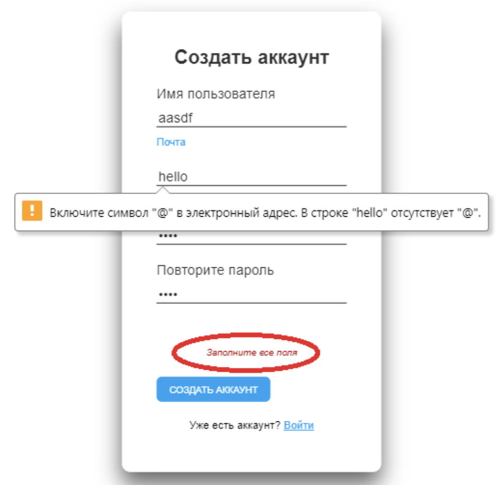
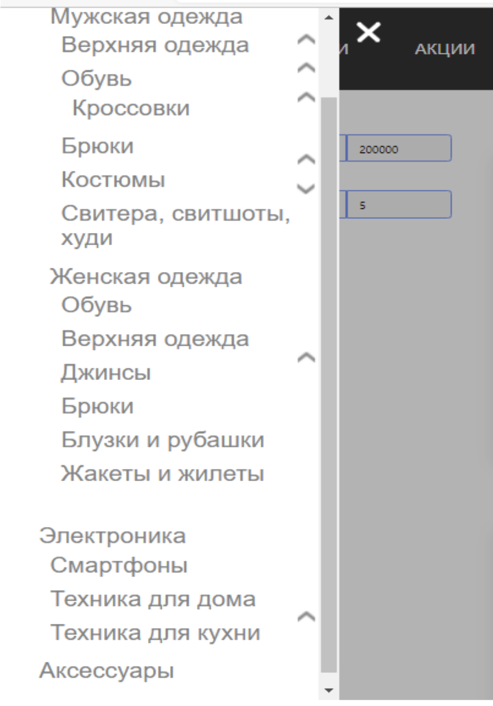
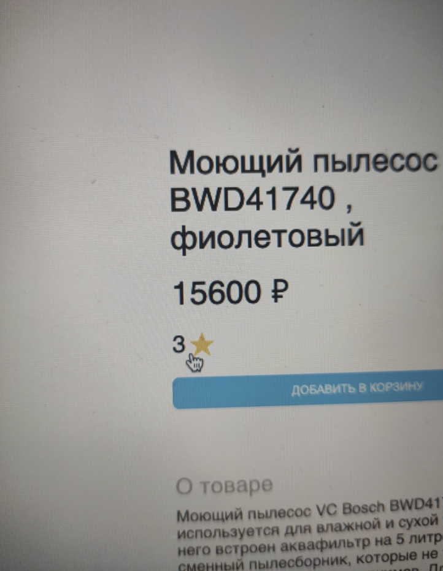
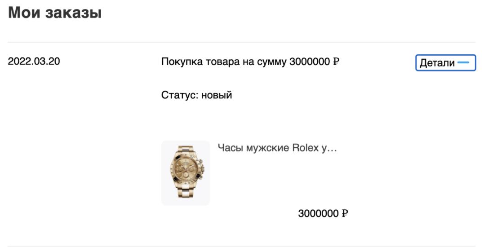
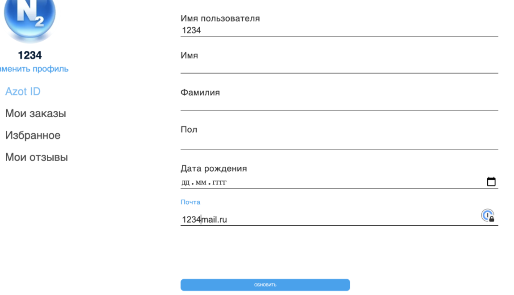
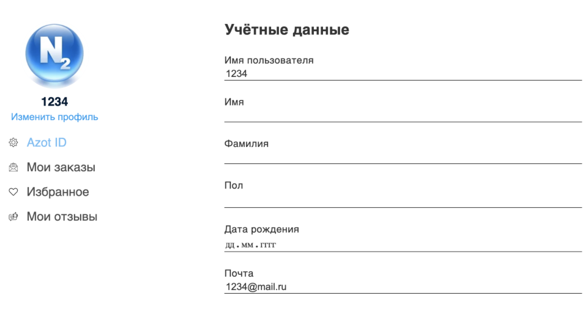
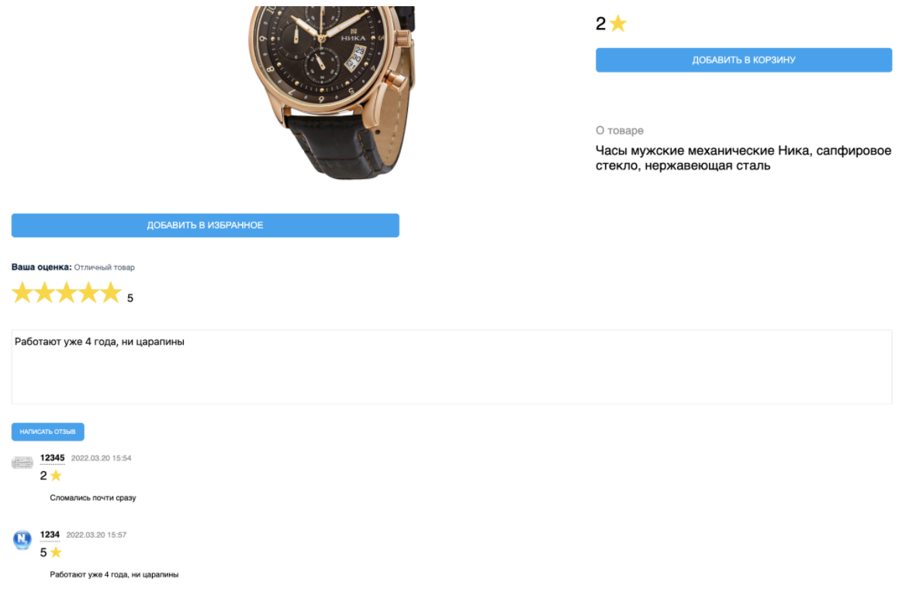
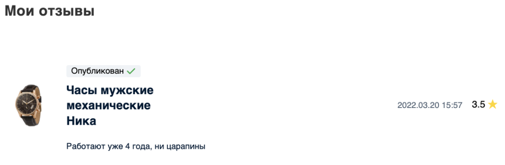
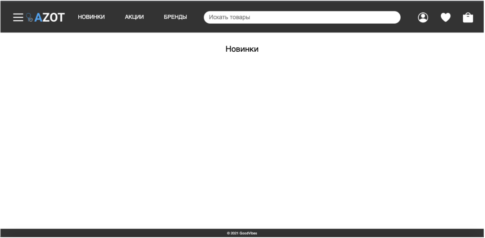

# Отчет о тестировании
[Ссылка на сайт](https://goodvibesazot.tk)
## Окружение: 
### Пункты 1-2, 8-13, 16-18
* бразер Google Chrome, версия 99.0.4844.74 (Официальная сборка), (x86_64)
* разрешение экрана 1680 x 1050
### Пункты 3-7, 14-15
* бразер Microsoft Edge Версия 99.0.1150.46 (Официальная сборка), (x86_64)
* разрешение экрана 1680 x 1050
## 1. Форма регистрации
### Форма регистрации - ОК:
1) При корректном заполнении формы (все поля в форме заполнены, в поле «Почта» есть символ @, в поля «Имя пользователя» и «Почта» введено не более 30 символов), и нажатии на кнопку «Создать аккаунт» происходит переход на страницу с товарами и успешная регистрация.  
2) Поля «Имя пользователя», «Придумайте пароль» и «Повторите пароль» могут содержать нелатинские символы (например, русские, китайские).
3) При оставлении хотя бы одного из полей в форме регистрации незаполненным и нажатии на кнопку «Создать аккаунт» появляется уведомление об ошибке «Заполните все поля»
4) При вводе почты в поле «Почта» без символа @ и нажатии на кнопку «Создать аккаунт» появляется уведомление об ошибке «Адрес электронной почты должен содержать символ @. В адресе <адрес> отсутствует символ».
5) При вводе почты в поле «Почта» без символа «.» в домене и нажатии на кнопку «Создать аккаунт» появляется уведомление об ошибке «Неверный формат данных».
6) При вводе в поле «Почта» почты c логином, имеющим налатинские символы (например, русские или китайские) и нажатии на кнопку «Создать аккаунт» появляется уведомление об ошибке «Часть адреса до символа @ не должна содержать символ <первый слева введенный нелатинский символ>».
7) При вводе в поле «Имя пользователя» имени пользователя, который уже зарегистрирован, и нажатии на кнопку «Создать аккаунт» появляется уведомление об ошибке «Пользователь уже существует»
8) При вводе в поле «Имя пользователя» или «Почта» текста больше 30 символов появляется уведомление об ошибке «Неизвестная ошибка сервера».
9) При вводе разных данных в поля «Придумайте пароль» и «Повторите пароль» появляется уведомление об ошибке «Пароли не одинаковые».
10) При попытке перетащить изображение во все поля формы регистрации поля остаются пустыми.
11) При попытке перетащить файлы (текстовые, бинарные, каталоги) во все поля формы регистрации поля остаются пустыми.
12) При нажатии на ссылку «Войти» происходит переход на страницу авторизации.
 
### Замечены баги:
* При оставлении хотя бы одного из полей в форме регистрации незаполненным и нажатии на кнопку «Создать аккаунт» появляется уведомление об ошибке «Заполните все поля». Затем при заполнении всех полей и при вводе почты в поле «Почта» без символа @ и нажатии на кнопку «Создать аккаунт» появляется уведомление об ошибке «Адрес электронной почты должен содержать символ @. В адресе <адрес> отсутствует символ». При этом уведомление об ошибке «Заполните все поля» остается.

* При вводе в поле «Почта» данных в неверном формате (в доменном имени отсутствует точка и следующий за ней домен) и нажатии на кнопку «Создать аккаунт», появляется уведомление об ошибке «Неправильный формат данных». Не показано, каким должен быть правильный формат данных.
* При вводе в поле «Пароль» одного символа (например, "1") и нажатии на кнопку «Создать аккаунт», появляется уведомление об ошибке «Неверный формат пароля». Не показано, каким должен быть правильный формат данных.

## 2. Форма авторизации
### Форма авторизации - ОК:
1) При вводе зарегистрированного логина и соответствующего логину пароля и нажатии на кнопку «Войти» происходит переход на страницу с товарами, успешная авторизация пользователя. Пример данных существующего пользователя: логин «12345», пароль «12345».
2) При вводе не зарегисрированного ранее логина и имеющегося в базе данных пароля, и нажатии на кнопку «Войти» не удается зайти в профиль пользователя, появляется уведомление об ошибке «Пользователя не существует»
3) При вводе большого количества символов в поле «Имя пользователя» (например, 1000 символов) и пароля, состоящего из любых символов, и нажатии на кнопку «Войти» не удается зайти в профиль пользователя, появляется уведомление об ошибке «Неверный пароль»
4) При вводе большого количества символов в поле «Пароль» (например, 1000 символов) и зарегистрированного пароля, и нажатии на кнопку «Войти» не удается зайти в профиль пользователя, появляется уведомление об ошибке «Пользователя не существует».
5) При вводе китайских символов  (например, 汉字漢字) в поле «Имя пользователя»  появляется уведомление об ошибке «Пользователя не существует».
6) При вводе китайских символов  (например, 汉字漢字) в поле «Пароль»  появляется уведомление об ошибке «Неверный пароль».
7) При попытке перетащить изображение в поля «Имя пользователя» /  «Пароль» поля остаются пустыми.
8) При попытке перетащить файлы (текстовые, бинарные, каталоги) в поля «Имя пользователя» /  «Пароль» поля остаются пустыми.
9) При вводе зарегистрированного логина и пароля, который не соответствует этому логину, и нажатии на кнопку «Войти» не удается зайти в профиль пользователя, появляется уведомление об ошибке «Неверный пароль»
10) При оставлении хотя бы одного из полей в форме авторизации незаполненным и нажатии на кнопку «Войти» не удается зайти в профиль пользователя, появляется уведомление об ошибке «Заполните все поля»
11) При нажатии на ссылку «Создать аккаунт»  происходит переход на страницу регистрации.
12) При нажатии на крестик в правом верхнем углу страницы происходит переход на страницу с товарами.

## 3. Главная страница со всеми товарами. 
### Главная страница со всеми товарами - ОК: 
1) При клике на карточку товара открывается страница товара. 
2) 4 товара с наибольшим количеством просмотров у текущего пользователя попадают в рекомендованные. 
### Замечены баги: 
* При обновлении страницы рекомендованные товары подгружаются
позднее остальных товаров.

## 4. Навигационная панель:
### Навигационная панель OK:
1) При клике на логотип сайта открывается страница всех товаров сайта.
2) При клике на «Новинки» открывается страница с новыми товарами.
3) При клике на «Акции» открывается страница с товарами, на которые действует акция.
4) При клике на «Бренды» открывается страница с брендами, которые представлены в магазине. 
5) При клике на картинку профиля у неавторизованного пользователя открывается страница авторизации.
6) При клике на картинку профиля у авторизованного пользователя появляется выпадающий список с доступными для перехода ссылками на страницы профиля. 
7) При клике на картинку избранного у неавторизованного пользователя открывается страница авторизации. 
8) При клике на картинку избранного у авторизованного пользователя открывается страница с избранными товарами. 
9) При клике на картинку корзины у неавторизованного пользователя открывается страница корзины. 
10) При клике на картинку корзины у авторизованного пользователя открывается страница корзины. 
11) При клике на кнопку, обозначаемую тремя полосками и расположенную левее логотипа сайта, появляется выпадающий список с категориями товаров. 
12) При клике на поле поиска появляется выпадающий список с 5 популярными товарами и 4 популярными категориями.

## 5. Выпадающий список с категориями:
### Выпадающий список с категориями - ОК: 
1) При клике на серую стрелку вверх правее текста «Все товары» скрываются все категории. 
2) При клике на серую стрелку вверх правее текста с названием любой категории скрывает подкатегории выбранной категории.  
3) При клике на серую стрелку вниз правее текста с названием любой категории раскрывает подкатегории выбранной категории.
4) a) У категории раскрыть подкатегорию.   
   б) У подкатегории раскрыть подкатегории.   
   в) Свернуть и развернуть родительскую категорию раскрытых двух подкатегорий.  
   г) Состояние раскрытых подкатегорий сохраняется.  
5) При клике на текст с названием любой категории открывается страница с товарами этой категории 
### Замечены баги: 
* а) Раскрыть такое количество подкатегорий, что их список не помещаются на один экран.   
  б) Проскроллить полученный список вниз.  
  в) Стрелки подкатегорий остаются на месте. 
 

## 6. Страница одной категории.
### Страница одной категории - ОК: 
1) На странице показываются товары только выбранной категории 
и ее подкатегорий. 
2) Сортировка по возрастанию/убыванию цены работает корректно. 
3) Сортировка по возрастанию/убыванию рейтинга работает корректно. 
4) Нельзя одновременно применить фильтр возрастания/убывания по цене и рейтингу. 
5) Сортировка с ограничениями минимальной/максимальной цены/рейтинга работает корректно. 
6) Сортировка по возрастанию/убыванию работает корректно с ограничениями минимальной/максимальной ценой/рейтингом.
7) При открытии страницы в поле ввода минимальной и максимальной цены подставляются минимальная и максимальная цена среди 
выбранных товаров. 
8) При попытке ввести в поле ввода минимальной цены цену, ниже цены самого дешевого товара происходит исправление на минимальную цену товара на странице. 
9) При попытке ввести в поле ввода максимальной цены, выше цены самого дорогого товара происходит исправление на максимальную цену товара на странице. 
10) Поля ввода, связанные с рейтингом работают аналогично пунктам 6) и 7)
11) При перезагрузке страницы сохраняются примененные фильтры по максимальной/минимальной цене. 
12) При перезагрузке страницы сохраняются примененные фильтры по максимальному/минимальному рейтингу.

## 7. Поле поиска: 
### Поле поиска - ОК: 
Под корректной работой поиска имеется в виду: повляется выпадающий список с искомыми товарами или категориями, или пустой список, если нет товаров или категорий удовлетворяющих поиску.  
1) Поиск корректно работает при введении полного названия товара или категории. 
2) Поиск корректно работает при введении части названия товара или категории.
3) Поиск корректно работает при быстром вводе текста. 
4) Поиск корректно работает при стирании частей текста.
5) При клике на элемент выпадающего списка результата поиска открывается страница найденного товара или категории. 
6) При нажатии на Enter открывается страница с результатами поиска и введенной для поиска строкой. 

## 8. Страница одного товара:
### Страница одного товара - ОК:
1) При нажатии на кнопку «добавить в избранное» авторизовавшись, происходит добавление товара в избранное.
2) При нажатии на кнопку «добавить в избранное» не авторизовавшись, происходит переход на страницу входа.
3) При нажатии на кнопку «удалить из избранного» авторизовавшись, происходит удаление.
4) При попытке отправить отзыв без оценки / без комментария / без оценки и комментария, выводится уведомление:  «Нужно выбрать оценку товара и написать отзыв», отзыв не отправляется.
5) Если в поле ввода «Количества добавления товара в корзину» ввести некорректное количество (пустое поле ввода, отрицательное число), товар в корзину не добавится.
6) При нажатии на другие карточки товара, изображение на странице меняется на то, которое было нажато.
7) При нажатии на кнопку «вернуться в каталог» происходит переход на главную страницу.
### Замечены баги:
* Кнопка «удалить из избранного» перестает работать после обновления страницы.
* При наведении курсора на оценку товара курсор меняется с дефолтного на “курсор-руку”, но при нажатии ничего не происходит.  
 
* При открытии страницы товара сохраняется выбор оценки под товаром, если раньше на другом товаре выставить оценку, но не отправить отзыв.
* При добавлении отзыва выбор оценки и поле ввода отзыва не очищаются.
* Время добавления отзыва отображается некорректно (выводится время по GMT+0, а не по часовому поясу пользователя).
* В корзину можно добавлять товары с огромным количеством (например, "1000000000000000"), из-за этого в корзине съезжает вёрстка.
 
## 9. Корзина
### Корзина - ОК:
1) При вводе всех данных о заказе в полях ввода внизу страницы и нажатии на кнопку «Оформить заказ», происходит оформление заказа и переход на страницу заказов пользователя.
2) При нажатии на крестик рядом с товаром в корзине товар удаляется из корзины.
3) При нажатии на стрелки «Вверх/вниз» в строке товара, колонке «Количество» происходит увеличение/уменьшение количества товаров.
4) При нажатии на название товара происходит переход на страницу одного товара.
5) При вводе в поле «Промокод» несуществующего промокода появляется уведомление об ошибке «Промокод недействителен».
6) В раскрывающемся списке под «Способом доставки» можно выбрать способ доставки.
7) В раскрывающемся списке под «Способом оплаты» можно выбрать способ оплаты.
8) Когда в корзине нет товаров появляется надпись «Ваша корзина пуста» и ссылка «Вернуться к покупкам». При нажатии по ссылке происходит переход переход на страницу товаров.
9) При введении числа 0 или отрицательного числа в поле ввода в колонке «Количество» в строке справа от товара, товар удаляется из корзины.
10) При введении числа в поле ввода в колонке «Количество» в строке справа от товара, число в колонке «Сумма» пересчитывается по формуле "число в колонке «Цена» умножить на число в колонке «Количество»".
11) При попытке ввести в поле ввода в колонке «Количество» символов, отличных от цифр, символа «,» и символа «e», ничего не происходит - символы не вводятся.
12) При введении дробного числа (числа вида «x,у», например «2,7») в поле ввода в колонке «Количество» в строке справа от товара, число в поле ввода в колонке «Количество» округляется вниз до целого (если было введено «2,7», оно округляется до «2»).

### Замечены баги:
* Если оставить поле ввода «Промокод» пустым и нажать на кнопку «Применить» ничего не происходит.
* При нажатии кнопки «Оформить заказ» и незаполненных полях ввода с данными о заказе происходит оформление заказа и переход на страницу заказов пользователя.
* При вводе в номере телефона данных, не содержащих цифр, при других заполненных полях, и нажатии кнопки «Оформить заказ», происходит оформление заказа и переход на страницу заказов пользователя.

* При вводе в поле «Email» данных, не содержащих символ @, при других заполненных полях, и нажатии кнопки «Оформить заказ», происходит оформление заказа и переход на страницу заказов пользователя.

## 10. Страница с профилем пользователя
### Страница с профилем пользователя - OK:
1) При нажатии на кнопку «Azot ID» справа появляются учетные данные пользователя. 
2) При нажатии на ссылку «Изменить профиль» внизу появляется кнопка «Обновить» и значок календаря.
3) При нажатии на поле «Пол» появляется выпадающий список с вариантами пола. 
4) При изменении полей «Имя», «Фамилия», «Пол», «Дата рождения»,«Почта» и нажатии кнопки «Обновить» происходит обновление данных пользователя, внизу появляется надпись «Данные обновлены!»
5) При нажатии на значок календаря появляется карточка с календарем для выбора даты.
6) При нажатии на аватарку появляется окно для выбора аватарки. При выборе аватарки и нажатии кнопки «Обновить» происходит обновление аватарки пользователя.
7) При нажатии на кнопку «Мои заказы»  происходит переход на страницу заказов.
8) При нажатии на кнопку «Избранное» происходит переход на страницу с избранными заказами.
9) При нажатии на кнопку «Мои отзывы» происходит переход на страницу отзывов пользователя.  
### Замечены баги:
* При изменении значения в поле «Имя пользователя» и нажатии кнопки «Обновить» кнопка обновить исчезает, но при перезагрузке страницы «Имя пользователя» остается прежним.
* При вводе в поле ввода «Почта» некорректных данных (удалить символ @) и нажатии кнопки «Обновить» кнопка обновить исчезает, никакой ошибки не возникает, но при перезагрузке страницы значение в поле «Почта» остается прежним.

## 11. Страница с избранными товарами
### Страница с избранными товарами - ОК:
1) При нажатии на карточку с товаром происходит переход на страницу одного товара.
2) При нажатии на кнопку «Мои заказы»  происходит переход на страницу заказов.
3) При нажатии на кнопку «Избранное» происходит переход на страницу с избранными заказами.
4) При нажатии на кнопку «Мои отзывы» происходит переход на страницу отзывов пользователя.  
5) При нажатии на кнопку «Новинки» в навбаре  происходит переход на страницу новых товаров.
6) При нажатии на кнопку «Бренды» в навбаре происходит переход на страницу с брендами.
7) При нажатии на кнопку «Акции» в навбаре происходит переход на страницу товаров с акциями.

## 12. Страница с заказами
### Страница с заказами - ОК:
1) При нажатии на кнопку «+» возле существующего заказа раскрывается информация о заказе и кнопка «+» изменяется на «-». 
2) При нажатиии на кнопку «-» информация о товаре скрывается и кнопка «-» меняется «+».
3) При нажатии на название товара в заказе происходит переход на страницу одного товара.
4) При отсутствии заказов в истории отображается надпись «Вы еще не сделали никаких заказов».

## 13. Страница с отзывами
### Страница с отзывами - ОК:
1) При нажатии на название товара в оставленном отзыве происходит переход на страницу одного товара.
2) При нажатии на кнопку «Azot ID» происходит переход на страницу профиля пользователя.
3) При нажатии на кнопку «Мои заказы»  происходит переход на страницу заказов.
4) При нажатии на кнопку «Избранное»  происходит переход на страницу избранных товаров пользователя.
5) При нажатии на кнопку «Новинки» в навбаре  происходит переход на страницу новых товаров.
6) При нажатии на кнопку «Бренды» в навбаре происходит переход на страницу с брендами.
7) При нажатии на кнопку «Акции» в навбаре происходит переход на страницу товаров с акциями.
### Замечены баги: 
* На странице отображается общий рейтинг товара, а не тот который выставил пользователь при добавлении отзыва.

* Отображаются отзывы предыдущего пользователя при первом заходе в «Мои отзывы». При перезагрузке страницы показаны отзывы нового пользователя.

		
## 14. Страница одного бренда. 
###	Страница одного бренда - ОК: 
1) На странице показываются товары только выбранного бренда.
2) При клике на карточку товара открывается страница товара.  
	
## 15. Фильтр товаров.
###	Фильтр товаров - ОК: 
1) При нажатии на Сортировать по «Цене» текст подсвечивается голубым цветом и применяется сортировка по цене. 
2) При нажатии на Сортировать по «Рейтингу» текст подсвечивается голубым цветом и применяется сортировка по рейтингу
3) Нельзя одновременно применить сортировку по цене и по рейтингу.
4) При повторном нажатии на выбранную сортировку она меняется на противоположную (с убывания на возрастание и наоборот). 

### Замечены баги: 
* При перезагрузке страницы не сохраняется применение сортировки по цене или рейтингу. 

## 16. Страница с новинками:
### Замечены баги:
* При открытии страницы нет поясняющей надписи о том, что на сайте отсутствуют новинки.

## 17. Страница с акциями:
### Страница с акциями - ОК:
1) При нажатии на карточку товара происходит переход на страницу этого товара.

## 18. Страница с брендами:
### Страница с брендами - ОК:
1) При нажатии на карточку бренда происходит переход на страницу этого бренда.
